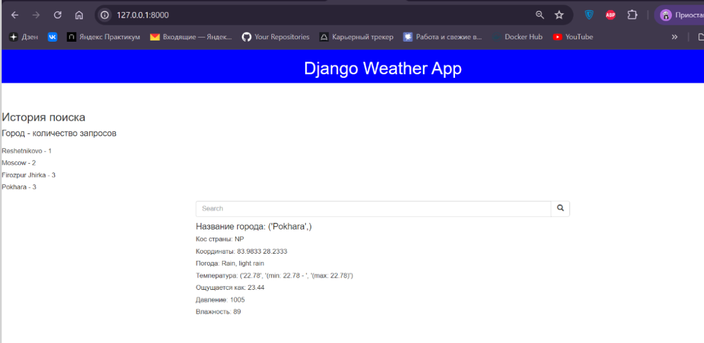

# Weather_app
Приложение для получения информации о погоде. Пользователь вводит название города,  и получает для него прогноз погоды на ближайшее время.


## Реализованные функции: 
- Пользователи могут получить информацию о погоде. Используется OpenWeatherMap
- После применения миграций в базу автоматически добавляется несколько тестовых пользователей и суперпользователь. В админку можно зайти используя пару:
{
  "username": "admin",
  "password": "admin"
}
- Подготовлена команда для загрузки городов.
- Для авторизованных пользователей сохраняется  и выводится на экран 
история просмотра с указанием того, сколько раз запрашивался каждый из городов
- Есть возможность посмотреть список пользователей с их историями и список городов.
- Приложение можно развернуть с помощью Docker.
- Подключена автодокументация 
- В зависимости от задач и удобства, можно переключаться с Postgres на SQLite и обратно,
поменяв только одну переменную в .env
- Внешний вид экрана:



### to do:
- Поменять ввод. Сейчас пользователь должен ввести название города. Может оказаться, что такого города нет или название города не уникально (например, есть два Санкт-Петербурга). Решение: вместо ввода сделать поиск с фильтрацией.
- Написать тесты
- Вывести на экран возможности авторизации и регистрации

##  Запуск проекта

### Запуск в контейнерах

1. Убедиться, что установлен Docker
2. Скопировать docker-compose.yml
3. Создать .env и заполнить по образцу .env.example
4. Запустить docker-compose.yml, выполнить миграции и собрать статику
```
docker compose up
docker compose exec backend python manage.py migrate
docker compose exec backend python manage.py collectstatic
docker compose exec backend cp -r /app/collected_static/. /static/
docker compose exec backend python manage.py load_cities

``` 

### Запуск без контейнеров

Клонировать репозиторий:   
 https://github.com/Anastasia289/Weather_app.git
   
Перейти в него в командной строке:  
```cd weather_up```  

Cоздать виртуальное окружение:   
```python -m venv venv ```  
  
Активировать виртуальное окружение:   
```source venv/scripts/activate```  
  
Установить зависимости из файла requirements.txt:  
```python -m pip install -r requirements.txt```

Выполнить миграции:   
``` python manage.py migrate```  

Загрузить города:  
``` python manage.py load_cities```

Запустить проект:   
```python manage.py runserver  ```


### Получить ключ OpenWeatherMap: 
Для того, чтобы получить ключ, нужно:
- зарегистрироваться и авторизоваться на сайте  OpenWeatherMap
- перейти на страницу My API Keys и скопировать свой уникальный API ключ. 
- Вставить ключ в .env. 
При желании этот пункт можно пропустить: в 
настройках уже указан дефолтный ключ. Но у него есть много ограничений. Для корректной работы приложения используйте свой. 


## Технологии: 
- Backend: Django, Django Rest Framework
- База данных: PostgreSQL
- Контейнеризация: Docker

[](https://skillicons.dev)
